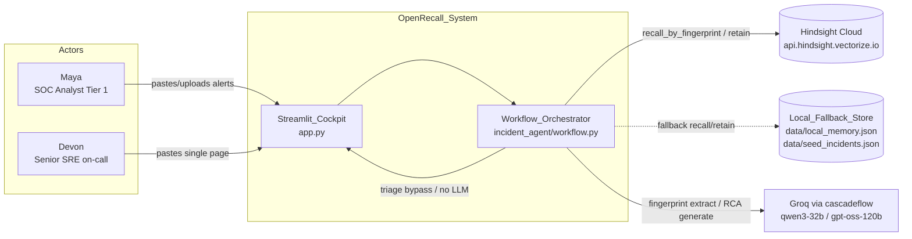
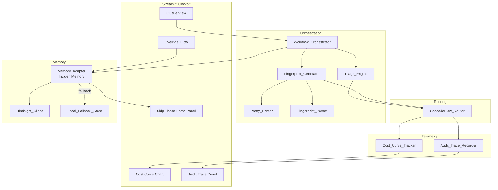
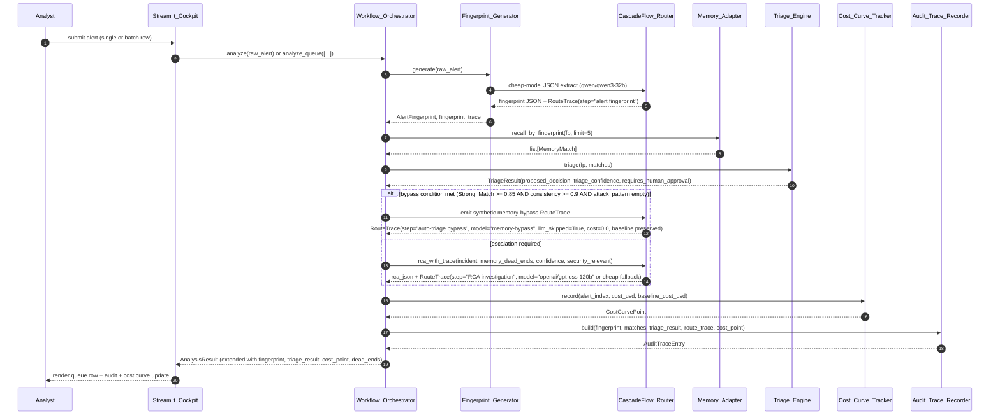
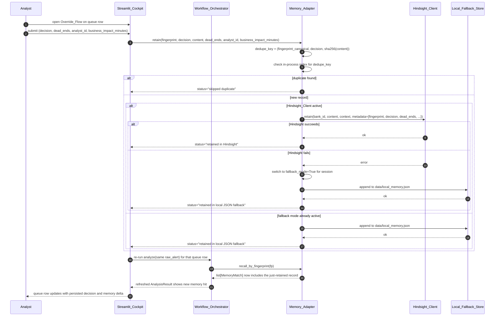

# Design Document — OpenRecall

## Overview

OpenRecall converts the existing single-incident `incident-memory-agent/` cockpit into a queue-driven alert triage co-pilot built on three load-bearing ideas: counterfactual memory keyed on a structured Alert DNA fingerprint, an auto-triage engine that bypasses the strong model when memory is consistent, and a live cost curve that proves the cascadeflow value in under sixty seconds of demo time. The design extends every existing module (`app.py`, `incident_agent/*.py`, `data/*.json`, `scripts/smoke_test.py`, `Makefile`, CI) rather than replacing them. The pre-OpenRecall single-alert path keeps working unchanged; new fields on `AnalysisResult` are additive with safe defaults so the historical smoke test, deterministic RCA pipeline, and cockpit hero render the same as before when no new code is invoked.

The memory backend shifts from local Hindsight Docker (`http://localhost:8888`) to Hindsight Cloud (`https://api.hindsight.vectorize.io`) using a Bearer-style `HINDSIGHT_API_KEY` header. A deterministic local JSON store (`data/seed_incidents.json` + `data/local_memory.json`) remains the safety net so the demo runs offline. CascadeFlow_Router keeps its existing httpx + cost_estimate + RouteTrace pattern; OpenRecall adds two new step kinds (`alert fingerprint`, `auto-triage bypass`) without touching the live Groq call shape.

The design favors deterministic, auditable behavior over clever inference. Fingerprint generation is cheap-model-first with a regex fallback so demo mode is reproducible without a vector database. The auto-triage decision is a hard threshold (Strong_Match score ≥ 0.85, Decision_Consistency ≥ 0.9, attack_pattern kill switch) instead of a learned weight, so property tests can express the bypass invariant as a single conjunction. Memory bypass emits a synthetic `model="memory-bypass"` RouteTrace so the audit invariant `len(audit_entries) == len(route_trace)` always holds. `analyze_queue` is a sequential loop over `analyze` so retain visibility from alert N to alert N+1 is observable in the same Streamlit session.

## Architecture

### System Context Diagram



### Component Diagram



### Primary Sequence — Single Alert Through the Queue



### Secondary Sequence — Retain After Analyst Override



### Triage Decision Flowchart

```mermaid
flowchart TD
    Start[AlertFingerprint fp + matches] --> Filter[Filter Strong_Matches: score >= 0.85]
    Filter --> HasStrong{any Strong_Match?}
    HasStrong -- no --> EscNoMatch[proposed_decision = escalated<br/>triage_confidence based on best score<br/>requires_human_approval = False]
    HasStrong -- yes --> AttackCheck{fp.attack_pattern non-empty?}
    AttackCheck -- yes --> KillSwitch[proposed_decision = escalated<br/>requires_human_approval = True<br/>reason: security-novel kill switch]
    AttackCheck -- no --> Group[group Strong_Matches by stored TriageDecision]
    Group --> Dom[dominant = mode of decisions<br/>n_dominant = count of dominant<br/>n_strong = total Strong_Matches]
    Dom --> Cons[Decision_Consistency = n_dominant / n_strong]
    Cons --> ConsCheck{Decision_Consistency >= 0.9?}
    ConsCheck -- no --> EscWeak[proposed_decision = escalated<br/>requires_human_approval = False<br/>reason: weak consistency]
    ConsCheck -- yes --> Propose[proposed_decision = dominant<br/>requires_human_approval = True<br/>triage_confidence = clamp_per_R5_5]
    Propose --> BypassCheck{decision in {false_positive, duplicate, known_benign}<br/>AND triage_confidence >= 0.85?}
    BypassCheck -- yes --> Bypass[CascadeFlow_Router emits memory-bypass RouteTrace<br/>llm_skipped=True, cost_usd=0.0]
    BypassCheck -- no --> RealOrEsc{decision == real?}
    RealOrEsc -- yes --> InvokeStrong[Router invokes strong model with memory dead_ends in prompt]
    RealOrEsc -- no --> InvokeStrong
    EscNoMatch --> InvokeStrong
    EscWeak --> InvokeStrong
    KillSwitch --> InvokeStrong
```

The threshold values `Strong_Match >= 0.85` and `Decision_Consistency >= 0.9` are constants `STRONG_MATCH_THRESHOLD` and `DECISION_CONSISTENCY_THRESHOLD` in `incident_agent/triage.py`. The bypass-confidence floor `0.85` is `BYPASS_CONFIDENCE_THRESHOLD`. These three names are referenced verbatim by the property tests so future tuning happens in one place.

## Components and Interfaces

### Component Responsibilities Table

| Component | Module | Responsibility |
| --- | --- | --- |
| Streamlit_Cockpit | `app.py` | Render hero, batch upload, queue view, override form, cost curve chart, audit panels, dead_ends panel; preserve existing CSS framework. |
| Workflow_Orchestrator | `incident_agent/workflow.py` | Coordinate fingerprint, recall, triage, optional LLM, retain; expose `analyze` (single) and `analyze_queue` (batch). |
| Fingerprint_Generator | `incident_agent/fingerprint.py` | Produce AlertFingerprint via cheap-model JSON-mode call with deterministic regex fallback; pretty-print and parse. |
| Pretty_Printer | `incident_agent/fingerprint.py` (function `format_fingerprint`) | Serialize AlertFingerprint into stable canonical string. |
| Fingerprint_Parser | `incident_agent/fingerprint.py` (function `parse_fingerprint`) | Parse canonical string back into AlertFingerprint. |
| Triage_Engine | `incident_agent/triage.py` | Convert (fingerprint, matches) into TriageResult under hard thresholds. |
| Memory_Adapter | `incident_agent/memory.py` | `recall_by_fingerprint`, `recall_by_decision`, `retain` with idempotence; Hindsight Cloud first, local JSON fallback. |
| CascadeFlow_Router | `incident_agent/router.py` | Existing cheap/strong routing; new `triage_with_trace` emits synthetic memory-bypass RouteTrace; new `fingerprint_with_trace` for the cheap extract step. |
| Cost_Curve_Tracker | `incident_agent/cost_curve.py` | In-memory time-ordered series; `record`, `series`, `mean_cost_per_alert`, `savings`. |
| Audit_Trace_Recorder | `incident_agent/audit.py` | Build per-alert AuditTraceEntry from RouteTrace + MemoryMatch + TriageResult. |
| Hindsight_Client | `incident_agent/memory.py` (private `_init_hindsight`) | Initialize SDK against `https://api.hindsight.vectorize.io` with Bearer header; health check; graceful failure. |
| Local_Fallback_Store | `data/seed_incidents.json` + `data/local_memory.json` | Deterministic JSON-backed memory used when Hindsight unreachable; same method shapes as Hindsight path. |
| Override_Flow | `app.py` (queue row form) | Capture analyst-chosen TriageDecision, dead_ends, analyst_id, business_impact_minutes; call retain. |

### Key Public Interfaces

#### `incident_agent/fingerprint.py`

```python
class FingerprintGenerator:
    def __init__(self, router: CascadeFlowRouter) -> None: ...
    def generate(self, raw_alert: str) -> tuple[AlertFingerprint, RouteTrace]: ...
    @staticmethod
    def format_fingerprint(fp: AlertFingerprint) -> str: ...
    @staticmethod
    def parse_fingerprint(text: str) -> AlertFingerprint: ...
    @staticmethod
    def regex_fallback(raw_alert: str) -> AlertFingerprint: ...
```

`format_fingerprint` emits exactly:

```
error_class=<v>; service_role=<v>; dependency_pattern=<v>; signal_shape=<v>; attack_pattern=<v>; environment=<v>
```

with empty fields rendered as the literal string `none`. Field order is fixed and documented as the canonical form. `parse_fingerprint` is a strict regex over the same shape; unknown keys raise `ValueError`. Together these implement Property 2 (round-trip).

#### `incident_agent/triage.py`

```python
STRONG_MATCH_THRESHOLD: Final[float] = 0.85
DECISION_CONSISTENCY_THRESHOLD: Final[float] = 0.9
BYPASS_CONFIDENCE_THRESHOLD: Final[float] = 0.85

class TriageEngine:
    def triage(self, fp: AlertFingerprint, matches: list[MemoryMatch]) -> TriageResult: ...
    @staticmethod
    def decision_consistency(strong_matches: list[MemoryMatch]) -> tuple[TriageDecision | None, float, int]: ...
    @staticmethod
    def confidence(consistency: float, n_strong: int) -> float: ...
```

#### `incident_agent/memory.py` (extensions)

```python
class IncidentMemory:
    # existing: recall(query, limit), retain(content, context, metadata), reflect(...), seed()
    def recall_by_fingerprint(self, fingerprint: AlertFingerprint, limit: int = 5) -> list[MemoryMatch]: ...
    def recall_by_decision(self, fingerprint: AlertFingerprint, decision: TriageDecision, limit: int = 5) -> list[MemoryMatch]: ...
    def retain(
        self,
        content: str,
        context: str = "incident memory",
        metadata: dict[str, Any] | None = None,
        *,
        fingerprint: AlertFingerprint | None = None,
        decision: TriageDecision | None = None,
        dead_ends: list[str] | None = None,
        analyst_id: str | None = None,
        business_impact_minutes: int | None = None,
    ) -> str: ...
```

The new keyword arguments are all optional; the legacy positional/keyword `(content, context, metadata)` call shape continues to work for `seed()` and for the existing learning-loop button in `app.py`.

#### `incident_agent/router.py` (extensions)

```python
class CascadeFlowRouter:
    # existing: normalize_with_trace, rca_with_trace, _call_model, _groq_chat
    def fingerprint_with_trace(self, raw_alert: str) -> tuple[dict | None, RouteTrace]: ...
    def triage_with_trace(self, fp: AlertFingerprint, triage_result: TriageResult, matches: list[MemoryMatch]) -> RouteTrace: ...
```

`fingerprint_with_trace` reuses `_call_model` with `step="alert fingerprint"`, `model=self.cheap_model`, and the fingerprint extraction prompt. `triage_with_trace` builds a synthetic `RouteTrace` with `step="auto-triage bypass"`, `model="memory-bypass"`, `route_reason=f"memory consistent across {n} prior decisions: {titles}"`, `confidence=triage_result.triage_confidence`, `latency_ms=0.0`, `estimated_cost_usd=0.0`, `strong_model_baseline_cost_usd=baseline_for_strong_rca_prompt(matches)`, `savings_vs_strong_usd=baseline`, `escalated=False`, `live_model_call=False`, plus the new fields `triage_decision_proposed`, `memory_match_score`, `decision_consistency`, `llm_skipped=True`.

#### `incident_agent/cost_curve.py`

```python
class CostCurveTracker:
    def __init__(self) -> None: ...
    def record(self, alert_index: int, cost_usd: float, baseline_cost_usd: float) -> CostCurvePoint: ...
    def series(self) -> list[CostCurvePoint]: ...
    def mean_cost_per_alert(self, batch_id: int | None = None) -> float: ...
    def savings(self) -> tuple[float, float, float]:
        """Returns (total_cost, total_baseline, percent_saved)."""
```

#### `incident_agent/audit.py`

```python
class AuditTraceRecorder:
    @staticmethod
    def build(
        fingerprint: AlertFingerprint,
        matches: list[MemoryMatch],
        triage_result: TriageResult,
        route_trace: list[RouteTrace],
        cost_point: CostCurvePoint,
    ) -> list[AuditTraceEntry]: ...
```

`build` returns one AuditTraceEntry per RouteTrace, preserving the audit-completeness invariant `len(audit_entries) == len(route_trace)`.

#### `incident_agent/workflow.py` (extensions)

```python
class IncidentWorkflow:
    # existing: analyze(raw_alert) -> AnalysisResult
    def analyze_queue(self, alerts: list[Alert]) -> list[AnalysisResult]: ...
```

`analyze_queue` is a deterministic sequential loop. It increments an internal `alert_index` counter shared with `Cost_Curve_Tracker`, calls `analyze` per alert, and returns results in submission order.

## Data Models

All models live in `incident_agent/models.py` unless noted. Pydantic v2.

| Model | Purpose |
| --- | --- |
| `Alert` | New thin wrapper around a queue input row: `raw_alert: str`, `title: str | None`, `submitted_at: str` (default `utc_now()`). |
| `AlertFingerprint` | Six-field structured signature: `error_class: str`, `service_role: str`, `dependency_pattern: str`, `signal_shape: str`, `attack_pattern: str`, `environment: str`. Empty fields stored as empty string. `model_config = ConfigDict(frozen=True)` so it is hashable. |
| `TriageDecision` | `Literal["false_positive", "duplicate", "known_benign", "real", "escalated"]` — matches the `IncidentType` Literal pattern already in `models.py`. |
| `TriageResult` | `proposed_decision: TriageDecision`, `triage_confidence: float` (0..1), `supporting_matches: list[MemoryMatch]`, `consistent_decision_count: int`, `requires_human_approval: bool`, `escalation_reason: str`. |
| `MemoryMatch` (extended) | Existing fields kept. `metadata` now expected to optionally carry `triage_decision: TriageDecision | None`, `dead_ends: list[str]`, `analyst_id: str | None`, `business_impact_minutes: int | None`, `fingerprint_canonical: str | None`. |
| `RouteTrace` (extended) | Existing fields kept. New optional fields with safe defaults: `triage_decision_proposed: TriageDecision | None = None`, `memory_match_score: float | None = None`, `decision_consistency: float | None = None`, `llm_skipped: bool = False`, `budget_exhausted: bool = False`. |
| `AnalysisResult` (extended) | Existing fields kept. New optional fields with safe defaults: `alert_fingerprint: AlertFingerprint | None = None`, `triage_result: TriageResult | None = None`, `cost_curve_point: CostCurvePoint | None = None`, `dead_ends: list[str] = []`, `audit_trace: list[AuditTraceEntry] = []`. |
| `CostCurvePoint` | `alert_index: int`, `cost_usd: float`, `baseline_cost_usd: float`, `cumulative_cost_usd: float`, `cumulative_baseline_usd: float`, `batch_id: int = 0`. |
| `AuditTraceEntry` | `step: str`, `model: str`, `route_reason: str`, `memory_hit_count: int`, `proposed_decision: TriageDecision | None`, `escalation_reason: str | None`, `live_model_call: bool`, `llm_skipped: bool`, `cost_usd: float`, `baseline_cost_usd: float`, `savings_usd: float`. |

The `dead_ends` field on `AnalysisResult` is the union of `metadata.dead_ends` across all returned MemoryMatch records, deduplicated and order-preserving (first-seen wins).

### Mode Matrix

| Mode | `HINDSIGHT_API_KEY` | `CASCADEFLOW_LIVE_GROQ` | Recall path | Fingerprint path | Triage bypass possible | RCA path on escalation | What the analyst sees |
| --- | --- | --- | --- | --- | --- | --- | --- |
| Hindsight Cloud + live Groq | set, host reachable | `true` + `GROQ_API_KEY` set | Cloud first, fallback if 5xx | Live cheap-model JSON extract | Yes | Live strong-model RCA | "Hindsight connected" badge, "Live model calls" badge, real costs in the curve. |
| Hindsight Cloud + Demo_Mode | set, host reachable | `false` | Cloud first, fallback if 5xx | Regex fallback (LIVE_GROQ off) | Yes | Deterministic RCA + cost trace | "Hindsight connected" badge, "Deterministic model output" badge, costs are the cheap-model estimates. |
| Local Fallback + live Groq | unset or unreachable | `true` + key set | `data/seed_incidents.json` + `data/local_memory.json` | Live cheap-model JSON extract | Yes | Live strong-model RCA | "Fallback memory" badge, "Live model calls" badge, recall keys on local seed. |
| Local Fallback + Demo_Mode | unset or unreachable | `false` | Local JSON only | Regex fallback | Yes | Deterministic RCA + cost trace | "Fallback memory" badge, "Deterministic model output" badge — judge-safe offline demo. |

### Configuration / Environment Variables

| Variable | Source Requirement | Default | Read by |
| --- | --- | --- | --- |
| `HINDSIGHT_BASE_URL` | R11.1 | `https://api.hindsight.vectorize.io` | `IncidentMemory._init_hindsight` |
| `HINDSIGHT_API_KEY` | R11.1, R12.1 | unset | `IncidentMemory._init_hindsight` |
| `HINDSIGHT_BANK_ID` | R11.1 | `openrecall` | `IncidentMemory._init_hindsight`, `retain` |
| `GROQ_API_KEY` | R12.1 | unset | `CascadeFlowRouter.__init__` |
| `CASCADEFLOW_MODE` | existing | `observe` | `CascadeFlowRouter._init_cascadeflow` |
| `CASCADEFLOW_LIVE_GROQ` | R3.3, R12.5 | `false` | `CascadeFlowRouter.__init__` |
| `CASCADEFLOW_RUN_BUDGET_USD` | R6.6 | `0.02` | `CascadeFlowRouter.__init__` |
| `CASCADEFLOW_CHEAP_MODEL` | R3.2 | `qwen/qwen3-32b` | `CascadeFlowRouter.__init__` |
| `CASCADEFLOW_STRONG_MODEL` | R6.2 | `openai/gpt-oss-120b` | `CascadeFlowRouter.__init__` |
| `OPENRECALL_PBT_SEED` | R15.3 | `20260101` | `tests/property/conftest.py` |
| `OPENRECALL_BATCH_SIZE_LIMIT` | R2.1 | `200` | `IncidentWorkflow.analyze_queue` |
| `HINDSIGHT_SEED_LIMIT` | existing | `0` (all) | `IncidentMemory.seed` |
| `HINDSIGHT_SEED_DELAY_SECONDS` | existing | `0` | `IncidentMemory.seed` |

Removed from `.env.example`: the open-source local Hindsight settings (`HINDSIGHT_API_LLM_PROVIDER`, `HINDSIGHT_API_LLM_API_KEY`, `HINDSIGHT_API_LLM_MODEL`, `HINDSIGHT_API_CONSOLIDATION_LLM_PROVIDER`, `HINDSIGHT_API_LLM_MAX_CONCURRENT`, `HINDSIGHT_API_RETAIN_LLM_MAX_CONCURRENT`, `HINDSIGHT_API_RETAIN_CHUNK_SIZE`, `HINDSIGHT_API_RETAIN_MAX_COMPLETION_TOKENS`). They remain harmless if a user keeps them in their local `.env`; the new code does not read them.


## Correctness Properties

*A property is a characteristic or behavior that should hold true across all valid executions of a system — essentially, a formal statement about what the system should do. Properties serve as the bridge between human-readable specifications and machine-verifiable correctness guarantees.*

These fifteen properties match the fifteen properties enumerated in `requirements.md` § Correctness Properties one-for-one. The test plan in the Testing Strategy section groups them into a smaller number of test files for ergonomics, but the design preserves the 1:1 mapping for traceability.

### Property 1: Fingerprint determinism in Demo_Mode

*For any* raw_alert string and any environment with `CASCADEFLOW_LIVE_GROQ=false`, two consecutive calls to `FingerprintGenerator.generate(raw_alert)` SHALL return AlertFingerprint instances that compare equal.

**Validates: Requirements 3.3, 3.4**

### Property 2: Fingerprint round-trip

*For any* AlertFingerprint `fp`, `parse_fingerprint(format_fingerprint(fp))` SHALL equal `fp`.

**Validates: Requirements 3.6, 3.7**

### Property 3: Triage proposal determinism

*For any* AlertFingerprint `fp` and any frozen `matches: list[MemoryMatch]`, two consecutive calls to `TriageEngine.triage(fp, matches)` SHALL return TriageResult instances whose `proposed_decision`, `triage_confidence`, and `requires_human_approval` fields are equal.

**Validates: Requirements 5.1, 5.2, 5.3**

### Property 4: Triage confidence bounds

*For any* TriageResult produced by `TriageEngine.triage(fp, matches)`, `0.0 <= triage_confidence <= 1.0`.

**Validates: Requirements 5.2**

### Property 5: Confidence reflects history

*For any* (fp, matches) where Decision_Consistency over `n >= 1` Strong_Matches is `c`, the resulting `triage_confidence` SHALL satisfy `c * (n / (n + 1)) <= triage_confidence <= c`.

**Validates: Requirements 5.2, 5.5**

### Property 6: Strong-model bypass invariant

*For any* alert whose recall set contains at least one Strong_Match (`score >= 0.85`) AND Decision_Consistency over Strong_Matches is `>= 0.9` AND `fp.attack_pattern` is empty AND the dominant decision is in `{false_positive, duplicate, known_benign}`, the resulting AnalysisResult `route_trace` SHALL contain zero entries with `model == "openai/gpt-oss-120b"` AND `live_model_call == True`, AND SHALL contain exactly one entry with `model == "memory-bypass"` AND `llm_skipped == True`.

**Validates: Requirements 6.1, 6.4, 6.5**

### Property 7: Idempotent retain

*For any* retain inputs `(fingerprint, decision, content, dead_ends, analyst_id)`, calling `IncidentMemory.retain(...)` twice in succession SHALL leave the underlying store with exactly one record matching the dedupe key `(format_fingerprint(fp), decision, sha256(content))`.

**Validates: Requirements 8.3**

### Property 8: Cost-curve monotonicity under repeating distribution

*For any* finite alert distribution `D` and two batches `B1, B2` sampled iid from `D` and processed in order with retain enabled between batches, `mean_cost_per_alert(B2) <= mean_cost_per_alert(B1)`.

**Validates: Requirements 9.5**

### Property 9: Cost-curve never exceeds baseline

*For any* CostCurvePoint `p` produced by `CostCurveTracker.record(...)`, `p.cost_usd <= p.baseline_cost_usd`, AND the series returned by `series()` is sorted by `alert_index` and has no gaps relative to record() call count.

**Validates: Requirements 9.1, 9.4**

### Property 10: Fallback-vs-cloud structural parity

*For any* raw_alert in Demo_Mode, the AnalysisResult instances produced by the Hindsight Cloud path and the Local_Fallback_Store path SHALL share the same Pydantic class, the same set of field names, and the same nested model classes per field. (Value equality is not required.)

**Validates: Requirements 11.4**

### Property 11: No-Strong-Match implies escalation

*For any* (fp, matches) where no MemoryMatch has `score >= 0.85`, the resulting `TriageResult.proposed_decision` SHALL equal `"escalated"`.

**Validates: Requirements 5.4**

### Property 12: Security-novel bypass refusal

*For any* (fp, matches) where `fp.attack_pattern` is non-empty AND no MemoryMatch has `score >= 0.85`, the resulting `TriageResult.proposed_decision` SHALL equal `"escalated"`.

**Validates: Requirements 5.6**

### Property 13: Recall-then-retain consistency

*For any* (fp, decision, content, dead_ends), after `IncidentMemory.retain(content, fingerprint=fp, decision=decision, dead_ends=dead_ends, ...)` succeeds in the same process, the next `IncidentMemory.recall_by_fingerprint(fp)` call SHALL return at least one MemoryMatch whose metadata reflects `decision` AND whose `metadata.dead_ends` contains every entry of the retained `dead_ends`.

**Validates: Requirements 7.4, 7.5, 8.5**

### Property 14: Budget enforcement

*For any* batch of alerts processed under `CASCADEFLOW_RUN_BUDGET_USD=B`, the sum of `estimated_cost_usd` across all RouteTrace entries with `live_model_call=True` SHALL be `<= B + estimated_cost_usd_of_final_in_flight_call`. After the budget is reached, every subsequent RouteTrace SHALL have `budget_exhausted=True` and `live_model_call=False`.

**Validates: Requirements 6.6**

### Property 15: Audit trace completeness

*For any* analyzed alert, `len(AnalysisResult.audit_trace) == len(AnalysisResult.route_trace)`, AND every AuditTraceEntry has its required fields populated (no None on `step`, `model`, `route_reason`, `live_model_call`, `cost_usd`, `baseline_cost_usd`).

**Validates: Requirements 10.1, 10.3**

## Error Handling

The OpenRecall design treats every external failure as recoverable to deterministic local behavior. Three failure surfaces matter.

**Hindsight Cloud failures.** `_init_hindsight` performs a HEAD/GET health probe against `HINDSIGHT_BASE_URL` with a 2 second timeout. Any non-2xx, any exception, or an unset `HINDSIGHT_API_KEY` flips `fallback_mode=True` for the session. Per-request failures (recall, retain, reflect) catch all exceptions, set `self.status` to a human-readable string with the exception class name, set `fallback_mode=True`, and route the same call to the Local_Fallback_Store with identical signature and return type. The cockpit re-renders the `Hindsight connected` / `Fallback memory` badge whenever `fallback_mode` flips.

**Groq / cascadeflow failures.** `_groq_chat` already catches exceptions inside `_call_model` and stores `model_error=exc.__class__.__name__`. OpenRecall extends this so that `fingerprint_with_trace` returning `None` triggers `FingerprintGenerator.regex_fallback(raw_alert)` instead of propagating. The RouteTrace still records the failed live attempt with `model_error` populated, so the audit trail shows the failure.

**Malformed batch input.** `analyze_queue` validates each entry. An entry that is missing `raw_alert`, has `raw_alert=""`, or fails Pydantic validation produces a placeholder `AnalysisResult` with `incident.error_type="invalid_alert"`, an empty `route_trace`, and a single AuditTraceEntry with `route_reason="batch entry rejected: <reason>"`. Processing continues to the next entry.

**Budget exhaustion.** When `accumulated_live_cost + estimated_cost_for_next_call > run_budget`, `CascadeFlow_Router._call_model` flips to deterministic output (no live call), sets `live_model_call=False`, `budget_exhausted=True`, and `route_reason="run budget exhausted; deterministic fallback"`. The current in-flight call is allowed to complete per the property statement.

**Pydantic validation errors on retain metadata.** Treated as fatal user-facing errors (the override form returns a Streamlit error toast) but not fatal to the workflow — the existing analysis result is preserved on `st.session_state`.

## Testing Strategy

OpenRecall uses a dual approach: example-based unit tests for UI rendering and signature checks, and Hypothesis property tests for the fifteen correctness properties. The property tests live under `tests/property/` and are invoked by `make pbt` (and CI).

### Test Files

| File | Properties Covered |
| --- | --- |
| `tests/property/conftest.py` | Hypothesis strategies and shared fixtures (no test functions). |
| `tests/property/test_fingerprint.py` | P1 (determinism), P2 (round-trip). |
| `tests/property/test_triage.py` | P3, P4, P5, P6, P11, P12. |
| `tests/property/test_memory.py` | P7 (idempotent retain), P10 (structural parity), P13 (recall-then-retain consistency). |
| `tests/property/test_cost_curve.py` | P8 (monotonicity), P9 (baseline + ordering), P14 (budget). |
| `tests/property/test_workflow.py` | P15 (audit completeness), queue ordering, end-to-end Demo_Mode runs. |

### Hypothesis Strategies (defined in `tests/property/conftest.py`)

```python
import string
from hypothesis import strategies as st
from incident_agent.models import (
    AlertFingerprint, MemoryMatch, TriageDecision, RouteTrace, CostCurvePoint,
)

# Tokens shaped like the regex extractor's output: lowercase, no whitespace.
_token = st.text(alphabet=string.ascii_lowercase + string.digits + "-_", min_size=1, max_size=24)
_field_or_empty = st.one_of(st.just(""), _token)

@st.composite
def alert_fingerprint_strategy(draw) -> AlertFingerprint:
    return AlertFingerprint(
        error_class=draw(_field_or_empty),
        service_role=draw(_field_or_empty),
        dependency_pattern=draw(_field_or_empty),
        signal_shape=draw(_field_or_empty),
        attack_pattern=draw(_field_or_empty),
        environment=draw(st.sampled_from(["", "production", "staging", "dev", "qa"])),
    )

triage_decision_strategy = st.sampled_from([
    "false_positive", "duplicate", "known_benign", "real", "escalated",
])

@st.composite
def memory_match_strategy(draw, score_min=0.0, score_max=1.0, decision=None) -> MemoryMatch:
    chosen = decision if decision is not None else draw(triage_decision_strategy)
    return MemoryMatch(
        title=draw(st.text(min_size=1, max_size=64)),
        content=draw(st.text(min_size=1, max_size=512)),
        score=draw(st.floats(min_value=score_min, max_value=score_max, allow_nan=False, allow_infinity=False)),
        source=draw(st.sampled_from(["hindsight", "local-json"])),
        metadata={
            "triage_decision": chosen,
            "dead_ends": draw(st.lists(st.text(min_size=1, max_size=32), max_size=4)),
            "fingerprint_canonical": draw(_token),
        },
    )

@st.composite
def strong_match_set_strategy(draw, dominant_decision, n_total, agreement_count) -> list[MemoryMatch]:
    """Builds n_total matches all with score >= 0.85 where exactly agreement_count carry dominant_decision."""
    matches = []
    for i in range(agreement_count):
        matches.append(draw(memory_match_strategy(score_min=0.85, score_max=1.0, decision=dominant_decision)))
    for i in range(n_total - agreement_count):
        other = draw(triage_decision_strategy.filter(lambda d: d != dominant_decision))
        matches.append(draw(memory_match_strategy(score_min=0.85, score_max=1.0, decision=other)))
    return matches

raw_alert_strategy = st.text(
    alphabet=st.characters(blacklist_categories=("Cs",)),  # exclude surrogates
    min_size=1, max_size=512,
)
```

The conftest also defines a `frozen_router` fixture that returns a `CascadeFlowRouter` with `live_groq=False`, a `frozen_memory` fixture with an in-memory dict-backed implementation of the same surface, and an `OPENRECALL_PBT_SEED=20260101` Hypothesis profile registered for CI determinism.

### Property Test Configuration

- Each property test runs minimum 100 iterations (`@settings(max_examples=100)`).
- Each test docstring carries the tag `Feature: openrecall, Property N: <text>` for traceability.
- A CI-only Hypothesis profile loads the deterministic seed: `settings.register_profile("ci", seed=20260101, max_examples=100)`.
- Failing inputs surface verbatim through Hypothesis's default falsifying-example printout.

### Example/Smoke Tests

- `tests/test_signatures.py` — `analyze(raw_alert: str) -> AnalysisResult` static signature equality, plus structural superset check on `AnalysisResult` fields.
- `scripts/smoke_test.py` extension — exercises `analyze_queue` with `data/seed_alerts.json`, asserts at least one `auto-triage bypass` RouteTrace appears, asserts cumulative `cost_usd <= cumulative baseline`, asserts the dead_ends panel input would render (i.e. AnalysisResult.dead_ends non-empty for at least one alert with seeded memory).
- `data/seed_incidents.json` schema check (every record has `triage_decision` and `dead_ends`) — runs in `make smoke`.
- `.env.example` content check — required keys present, no live keys (regex `gsk_[A-Za-z0-9_]{20,}|hsk_[A-Za-z0-9_]{20,}` must not match).

PBT applies cleanly to OpenRecall because the load-bearing components (fingerprint generation, triage decision, idempotent retain, cost curve aggregation, audit emission) are pure functions or pure-with-explicit-state methods. UI rendering, Streamlit DOM behavior, and live Hindsight/Groq integration are out of PBT scope and rely on snapshot/example tests and the offline smoke test instead.

## Low-Level Design

### File-by-file Plan

All paths are relative to `incident-memory-agent/`.

**New files**

| Path | Purpose |
| --- | --- |
| `incident_agent/fingerprint.py` | `FingerprintGenerator`, `AlertFingerprint` import, `format_fingerprint`, `parse_fingerprint`, regex extractor. |
| `incident_agent/triage.py` | `TriageEngine`, threshold constants, `decision_consistency`, `confidence`. |
| `incident_agent/cost_curve.py` | `CostCurveTracker` and the `CostCurvePoint` model factory. |
| `incident_agent/audit.py` | `AuditTraceRecorder` and the `AuditTraceEntry` model factory. |
| `data/seed_alerts.json` | Synthetic ~100-alert demo batch (generator script described below). |
| `scripts/generate_seed_alerts.py` | Deterministic generator that emits `data/seed_alerts.json` from a Python seed. |
| `tests/__init__.py` | Empty marker (so `tests/` is a package). |
| `tests/property/__init__.py` | Empty marker. |
| `tests/property/conftest.py` | Hypothesis strategies, fixtures, registered CI profile. |
| `tests/property/test_fingerprint.py` | P1, P2. |
| `tests/property/test_triage.py` | P3, P4, P5, P6, P11, P12. |
| `tests/property/test_memory.py` | P7, P10, P13. |
| `tests/property/test_cost_curve.py` | P8, P9, P14. |
| `tests/property/test_workflow.py` | P15, queue ordering, Demo_Mode end-to-end. |

**Extended files**

| Path | Change |
| --- | --- |
| `incident_agent/models.py` | Add `Alert`, `AlertFingerprint`, `TriageDecision`, `TriageResult`, `CostCurvePoint`, `AuditTraceEntry`. Extend `RouteTrace` with the four new optional fields and `budget_exhausted`. Extend `AnalysisResult` with the five new optional fields. |
| `incident_agent/memory.py` | Update `_init_hindsight` to default `https://api.hindsight.vectorize.io`, inject `Authorization: Bearer ${HINDSIGHT_API_KEY}` (see Hindsight client wiring below), default `bank_id` to `openrecall`. Add `recall_by_fingerprint`, `recall_by_decision`. Extend `retain` keyword-only with the new fields. Carry `dead_ends` and `triage_decision` through metadata into MemoryMatch. Implement in-process dedupe index keyed on `(format_fingerprint(fp), decision, sha256(content))`. |
| `incident_agent/router.py` | Add `fingerprint_with_trace`, `triage_with_trace`. Add `budget_exhausted` flag carry-through and the four new RouteTrace fields. Track cumulative live cost so `budget_exhausted` can be computed. |
| `incident_agent/workflow.py` | Wire `FingerprintGenerator`, `TriageEngine`, `CostCurveTracker`, `AuditTraceRecorder`. Implement `analyze_queue`. Keep `analyze` signature intact; populate the new optional `AnalysisResult` fields. |
| `incident_agent/__init__.py` | Export new public names. |
| `app.py` | Add Queue tab with batch upload + queue table, Override_Flow form, dead_ends panel, cost curve chart (Altair), audit panel per row. Preserve existing CSS and hero. |
| `data/seed_incidents.json` | Add `"triage_decision": "real"` and `"dead_ends": []` to every record. |
| `.env.example` | Replace local Hindsight Docker block with cloud + new vars. |
| `pyproject.toml` | Rename `name` from `incident-memory-agent` to `openrecall`. Bump version to `0.2.0`. Keep dependency list, add `[project.optional-dependencies] dev = ["hypothesis>=6.108", "pytest>=8.0", "altair>=5.2"]`. |
| `requirements.txt` | Add `hypothesis>=6.108`, `pytest>=8.0`, `altair>=5.2`. |
| `Makefile` | Add `pbt` target: `.venv/bin/python -m pytest tests/property -q`. Extend `compile` to include the new modules. Extend `smoke` to first call `pbt`. |
| `.github/workflows/ci.yml` | Add `python -m pytest tests/property --hypothesis-profile=ci` step before the smoke step. Set `OPENRECALL_PBT_SEED=20260101`. |
| `README.md` | Reframe top section as "OpenRecall" with the three-pillar pitch, demo flow, and judging rubric mapping; keep the existing setup/run sections. |
| `docs/ARCHITECTURE.md` | Replace flow with the new Queue-driven flow; embed the four Mermaid diagrams from this design. |
| `docs/DEMO.md` | Add the 60-second demo script: load `data/seed_alerts.json`, watch the cost curve drop, override one row, retain, watch the next batch bypass it. |
| `docs/HACKATHON_SUBMISSION.md` | Update rubric mapping to the three pillars; add property-test coverage as a "Technical Implementation" bullet. |
| `content/article_draft.md`, `content/social_post.md`, `content/demo_video_script.md` | Reframe copy from "Incident Memory Agent" to "OpenRecall"; preserve voice. |
| `scripts/smoke_test.py` | Extend to exercise queue + bypass + dead_ends per R14.3. |

**Removed/renamed**

Nothing is deleted. The pyproject project name moves from `incident-memory-agent` to `openrecall` (recommended; flag in PR). Module path `incident_agent/` stays unchanged so existing imports work — we are renaming the project copy and the cockpit hero, not the Python package. `data/local_memory.json` keeps its current shape and is the same fallback file used today.

### Hindsight Cloud Client Wiring

The `hindsight-client` SDK should be probed first for native API key support. If `Hindsight(base_url=..., api_key=...)` is supported, use it. If only `Hindsight(base_url=...)` is supported, OpenRecall ships a thin wrapper that injects the header at the underlying httpx layer:

```python
def _build_hindsight_client(base_url: str, api_key: str | None) -> Any:
    from hindsight_client import Hindsight  # type: ignore
    try:
        return Hindsight(base_url=base_url, api_key=api_key)  # native support
    except TypeError:
        client = Hindsight(base_url=base_url)
        # SDK exposes either `_client` (httpx.Client) or `client`
        underlying = getattr(client, "_client", None) or getattr(client, "client", None)
        if underlying is not None and api_key:
            underlying.headers["Authorization"] = f"Bearer {api_key}"
        return client
```

If neither attribute exists at runtime, the wrapper logs the SDK shape and flips fallback mode without raising. The init pseudocode below uses this helper.

### Pseudocode

#### Auto-triage decision algorithm

```
function triage(fp, matches):
    strong = [m for m in matches if m.score >= STRONG_MATCH_THRESHOLD]
    if len(strong) == 0:
        return TriageResult(
            proposed_decision="escalated",
            triage_confidence=max((m.score for m in matches), default=0.0),
            supporting_matches=[],
            consistent_decision_count=0,
            requires_human_approval=False,
            escalation_reason="no Strong_Match in memory",
        )
    if fp.attack_pattern != "":
        # security-novel kill switch: any attack_pattern with no Strong_Match is escalated above;
        # with Strong_Match present we still inspect, but we never auto-bypass for security.
        # If consistency is high we still propose, but flag requires_human_approval=True.
        pass
    decisions = [m.metadata.get("triage_decision") for m in strong]
    grouped = Counter(d for d in decisions if d is not None)
    if not grouped:
        return TriageResult(
            proposed_decision="escalated",
            triage_confidence=mean(m.score for m in strong),
            supporting_matches=strong,
            consistent_decision_count=0,
            requires_human_approval=False,
            escalation_reason="strong matches lack stored decisions",
        )
    dominant, n_dominant = grouped.most_common(1)[0]
    n_strong = len(strong)
    consistency = n_dominant / n_strong
    if consistency < DECISION_CONSISTENCY_THRESHOLD:
        return TriageResult(
            proposed_decision="escalated",
            triage_confidence=consistency,
            supporting_matches=strong,
            consistent_decision_count=n_dominant,
            requires_human_approval=False,
            escalation_reason="decision consistency below threshold",
        )
    if fp.attack_pattern != "":
        # Strong match + high consistency + security-novel: still require human approval
        return TriageResult(
            proposed_decision=dominant,
            triage_confidence=clamp_confidence(consistency, n_strong),
            supporting_matches=strong,
            consistent_decision_count=n_dominant,
            requires_human_approval=True,
            escalation_reason="security-novel: human approval required",
        )
    return TriageResult(
        proposed_decision=dominant,
        triage_confidence=clamp_confidence(consistency, n_strong),
        supporting_matches=strong,
        consistent_decision_count=n_dominant,
        requires_human_approval=True,
        escalation_reason="memory consistent",
    )

function clamp_confidence(c, n):
    # Property 5 bound: c * (n / (n + 1)) <= conf <= c
    lower = c * (n / (n + 1))
    upper = c
    # Pick a value monotonic in n that satisfies the bound:
    return min(upper, max(lower, c * (1 - 1 / (n + 2))))
```

Tie-breaking on `grouped.most_common`: if two decisions tie, `Counter` preserves insertion order. Insertion order is deterministic because `decisions` is built by iterating `strong` in score-descending order (we sort `strong` by `score` desc before the Counter). The tie-break therefore goes to the higher-scoring match. This is documented in a comment in the code.

#### Fingerprint generation

```
function generate(raw_alert):
    if router.live_groq and router.api_key:
        prompt = build_fingerprint_prompt(raw_alert)
        response, trace = router.fingerprint_with_trace(raw_alert)
        if response is not None:
            try:
                fp = AlertFingerprint(**fill_missing_with_regex(response, raw_alert))
                return fp, trace
            except ValidationError:
                pass  # fall through to regex
    fp = regex_fallback(raw_alert)
    trace = build_synthetic_trace(step="alert fingerprint", model=router.cheap_model,
                                  reason="deterministic regex fallback (LIVE_GROQ off or model returned malformed JSON)",
                                  cost_usd=0.0, baseline_cost_usd=estimate_cost(raw_alert, router.strong_model),
                                  live_model_call=False)
    return fp, trace

function fill_missing_with_regex(response, raw_alert):
    # response: dict from cheap-model JSON. Fill any missing/empty field from regex_fallback.
    fb = regex_fallback(raw_alert)
    return {
        field: response.get(field) or getattr(fb, field)
        for field in ("error_class","service_role","dependency_pattern","signal_shape","attack_pattern","environment")
    }

function regex_fallback(raw_alert):
    text = raw_alert.lower()
    return AlertFingerprint(
        error_class=infer_error_type(text),                       # reuses workflow.py helper
        service_role=pick_known_service(text) or "",
        dependency_pattern=infer_dependency(text) or "",
        signal_shape=match_first(text, ["5xx","4xx","timeout","crashloop","oom","latency","p95"], default=""),
        attack_pattern=match_first(text, ["sql injection","credential stuffing","jwt","waf","attack","csrf","xss"], default=""),
        environment=match_first(text, ["production","prod","staging","dev","qa"], default="production"),
    )
```

`match_first` returns the first matching pattern or the default. The same helpers `infer_error_type`, `pick_known_service`, `infer_dependency` already exist in `workflow.py` and are moved into `fingerprint.py` (or imported from `workflow.py`; the design recommends moving them into `fingerprint.py` and having `workflow.py` import from there to avoid duplication).

#### Hindsight Cloud client init with health check

```
function _init_hindsight():
    self.base_url = env("HINDSIGHT_BASE_URL", "https://api.hindsight.vectorize.io")
    self.bank_id = env("HINDSIGHT_BANK_ID", "openrecall")
    self.api_key = env("HINDSIGHT_API_KEY", "")
    if not self.api_key:
        self.client = None
        self.fallback_mode = True
        self.status = "fallback mode: HINDSIGHT_API_KEY unset"
        return
    try:
        # Health probe: HEAD on base_url with 2s timeout
        httpx.head(self.base_url, timeout=2, headers={"Authorization": f"Bearer {self.api_key}"})
        self.client = _build_hindsight_client(self.base_url, self.api_key)
        self.fallback_mode = False
        self.status = f"connected to Hindsight Cloud at {self.base_url} / bank {self.bank_id}"
    except Exception as exc:
        self.client = None
        self.fallback_mode = True
        self.status = f"fallback mode: Hindsight Cloud unreachable ({exc.__class__.__name__})"
```

Health probe semantics: a 401/403 from Hindsight is treated as a successful health check (the host is up, key is the only problem); a connection error or 5xx flips to fallback. We keep the heuristic narrow because the smoke test points `HINDSIGHT_BASE_URL` at `http://127.0.0.1:9` to exercise the fallback path.

#### Cost curve series with bypass case

```
class CostCurveTracker:
    def __init__(self):
        self._points: list[CostCurvePoint] = []
        self._cum_cost = 0.0
        self._cum_baseline = 0.0
        self._batch_id = 0

    def begin_batch(self):
        self._batch_id += 1

    def record(self, alert_index, cost_usd, baseline_cost_usd):
        self._cum_cost += cost_usd
        self._cum_baseline += baseline_cost_usd
        point = CostCurvePoint(
            alert_index=alert_index,
            cost_usd=cost_usd,                          # may be 0.0 on memory-bypass
            baseline_cost_usd=baseline_cost_usd,        # never 0.0 — preserved from strong-model estimate
            cumulative_cost_usd=self._cum_cost,
            cumulative_baseline_usd=self._cum_baseline,
            batch_id=self._batch_id,
        )
        self._points.append(point)
        return point

    def series(self):
        return list(self._points)

    def mean_cost_per_alert(self, batch_id=None):
        pts = [p for p in self._points if batch_id is None or p.batch_id == batch_id]
        if not pts:
            return 0.0
        return sum(p.cost_usd for p in pts) / len(pts)

    def savings(self):
        if self._cum_baseline == 0.0:
            return (self._cum_cost, self._cum_baseline, 0.0)
        pct = 100.0 * (self._cum_baseline - self._cum_cost) / self._cum_baseline
        return (self._cum_cost, self._cum_baseline, pct)
```

The bypass case: when `Workflow_Orchestrator` records a bypassed alert it sums `cost_usd = sum(t.estimated_cost_usd for t in route_trace)` (which includes the fingerprint step's small cost and zero for the `auto-triage bypass` step) and `baseline_cost_usd = sum(t.strong_model_baseline_cost_usd for t in route_trace)`. The fingerprint step's tiny cost can make `cost_usd > 0` on bypass, but is still well below baseline. Property 9 holds because `baseline_cost_usd` is computed from the same prompt token estimate.

#### Retain idempotence

```
function retain(content, fingerprint=None, decision=None, dead_ends=None, ...):
    dedupe_key = (
        format_fingerprint(fingerprint) if fingerprint else "",
        decision or "",
        sha256(content.encode("utf-8")).hexdigest(),
    )
    if dedupe_key in self._dedupe_index:
        return "skipped duplicate"
    self._dedupe_index.add(dedupe_key)
    metadata = {
        "fingerprint_canonical": dedupe_key[0],
        "triage_decision": decision,
        "dead_ends": dead_ends or [],
        "analyst_id": analyst_id,
        "business_impact_minutes": business_impact_minutes,
    }
    if self.client is not None:
        try:
            self.client.retain(bank_id=self.bank_id, content=content, context=context,
                               timestamp=utc_now(), metadata=metadata)
            return "retained in Hindsight"
        except Exception as exc:
            self.fallback_mode = True
            self.status = f"fallback mode: Hindsight retain failed ({exc.__class__.__name__})"
            # fall through to local
    item = {"title": context, "content": content, "metadata": metadata, "timestamp": utc_now()}
    memories = self._load_local_retained_memory()
    if any(_match_dedupe(existing, dedupe_key) for existing in memories):
        return "local JSON fallback already had this memory"
    memories.append(item)
    LOCAL_MEMORY_PATH.write_text(json.dumps(memories, indent=2))
    return "retained in local JSON fallback"

function _match_dedupe(existing, dedupe_key):
    md = existing.get("metadata", {})
    existing_key = (
        md.get("fingerprint_canonical", ""),
        md.get("triage_decision", "") or "",
        sha256(str(existing.get("content","")).encode("utf-8")).hexdigest(),
    )
    return existing_key == dedupe_key
```

`self._dedupe_index` is an in-process set initialized empty; its purpose is to make `Property 7` hold within a single process for the Hindsight Cloud path (Hindsight's server-side dedupe is not relied on for the property test). Local-fallback dedupe additionally checks the JSON file because `local_memory.json` may persist across processes.

#### Queue UI render loop

```
for idx, result in enumerate(st.session_state.queue_results):
    badge_color = badge_color_for(result.triage_result.proposed_decision)
        # false_positive -> green, duplicate -> blue, known_benign -> teal,
        # real -> orange, escalated -> red
    cols = st.columns([3, 2, 2, 1])
    with cols[0]:
        st.markdown(fingerprint_badge_html(result.alert_fingerprint, badge_color), unsafe_allow_html=True)
    with cols[1]:
        st.markdown(triage_badge_html(result.triage_result), unsafe_allow_html=True)
        st.progress(result.triage_result.triage_confidence)
    with cols[2]:
        if result.dead_ends:
            with st.expander(f"Skip these paths ({len(result.dead_ends)})"):
                for d in result.dead_ends:
                    st.markdown(f"- {d}")
        else:
            st.caption("no dead ends recorded")
    with cols[3]:
        if st.button("Override", key=f"override_{idx}"):
            st.session_state.override_drafts[idx] = {"decision": result.triage_result.proposed_decision}
    if idx in st.session_state.override_drafts:
        render_override_form(idx, result)
    with st.expander(f"Audit trace ({len(result.audit_trace)} steps)"):
        for entry in result.audit_trace:
            render_audit_row(entry)
```

#### Decision_Consistency algorithm

```
function decision_consistency(strong_matches):
    if not strong_matches:
        return (None, 0.0, 0)
    sorted_matches = sorted(strong_matches, key=lambda m: m.score, reverse=True)
    decisions = [m.metadata.get("triage_decision") for m in sorted_matches]
    counter = Counter(d for d in decisions if d is not None)
    if not counter:
        return (None, 0.0, 0)
    dominant, n_dominant = counter.most_common(1)[0]
    consistency = n_dominant / len(sorted_matches)
    return (dominant, consistency, n_dominant)
```

### Streamlit State Model

| `st.session_state` key | Type | Purpose |
| --- | --- | --- |
| `queue_results` | `list[AnalysisResult]` | Results of the most recent batch in submission order. |
| `batch_id` | `int` | Monotonically incremented when a new batch is submitted; passed to `CostCurveTracker.begin_batch`. |
| `override_drafts` | `dict[int, dict]` | Keyed by `alert_index` within the current queue; holds in-progress override form values. |
| `result` | `AnalysisResult` | Existing single-alert result; preserved for backward compatibility. |
| `memory_fallback` | `bool` | Existing flag; preserved. |
| `cost_tracker` | `CostCurveTracker` | Cached resource bound to the cockpit session. |

### Cost Curve Chart

OpenRecall uses `st.altair_chart` rather than `st.line_chart`. Rationale: the chart compares two series (OpenRecall cost and strong-model-only baseline) with a shaded savings region between them, and Altair supports the layered area + line chart in a single declaration. `st.line_chart` would require two separate calls and cannot easily render the shaded savings band. The Altair spec is:

```python
chart = (
    alt.Chart(df)
    .transform_fold(["cost_usd", "baseline_cost_usd"], as_=["series", "value"])
    .mark_line()
    .encode(x="alert_index:Q", y="value:Q", color="series:N")
)
band = (
    alt.Chart(df)
    .mark_area(opacity=0.18, color="#15803d")
    .encode(x="alert_index:Q", y="cost_usd:Q", y2="baseline_cost_usd:Q")
)
st.altair_chart(band + chart, use_container_width=True)
```

`altair>=5.2` is added to `requirements.txt`.

### Synthetic seed_alerts.json Generator Design

`scripts/generate_seed_alerts.py` is a deterministic script (uses `random.seed(20260101)` from the `OPENRECALL_PBT_SEED`). Distribution and totals:

| Class | Count | How |
| --- | --- | --- |
| Repeats from 8 fingerprint families | 50 | 8 templates, ~6 alerts per family with surface-level wording variation. |
| One-off false positives | 30 | Pen-test scanner alerts, scheduled job alerts, internal vuln scan. |
| Novel real incidents | 15 | Unique error_class + dependency_pattern combos not in seed_incidents. |
| Ambiguous | 5 | Mixed signals where Decision_Consistency would land below 0.9. |
| **Total** | **100** | |

Each entry conforms to the existing `data/sample_alerts.json` schema: `{"title": ..., "raw_alert": ...}`. The script writes `data/seed_alerts.json` with `indent=2` so diffs are reviewable.

The 8 fingerprint families align with the existing seed_incidents memory so the demo cost curve drops visibly: `auth-service ConfigMap missing key`, `checkout-service CrashLoopBackOff env var`, `payments-api DB pool exhausted`, `worker-service Redis timeout`, `frontend feature flag 5xx`, `api-gateway JWT validation`, `waf SQL injection`, `notifications-service expired SMTP credential`.

### Migration Plan for `data/seed_incidents.json`

Each existing record gets two new fields appended:

```diff
 {
   "title": "...",
   ...
+  "triage_decision": "real",
+  "dead_ends": []
 }
```

`format_seed_memory` in `memory.py` does not read these fields, so the existing format string is unchanged. `_load_seed_memory` is extended to copy `triage_decision` and `dead_ends` from `item` into the memory's `metadata` dict so `recall_by_fingerprint` and `recall_by_decision` see them. Existing readers that ignore `metadata` are unaffected.

### Backward Compatibility Plan

- `IncidentWorkflow.analyze(raw_alert: str) -> AnalysisResult` keeps its exact signature and continues to work without any new arguments.
- All new fields on `AnalysisResult` (`alert_fingerprint`, `triage_result`, `cost_curve_point`, `dead_ends`, `audit_trace`) have safe defaults (`None`, `[]`) so any caller that does not opt into them sees the same behavior as before.
- New fields on `RouteTrace` (`triage_decision_proposed`, `memory_match_score`, `decision_consistency`, `llm_skipped`, `budget_exhausted`) all default to `None`/`False` and do not break `app.py`'s existing audit table renderer (every column it reads still exists with the same name).
- The legacy `IncidentMemory.recall(query, limit)` method stays untouched; `recall_by_fingerprint` is additive. The legacy `retain(content, context, metadata)` positional shape still works because the new arguments are keyword-only.
- `data/seed_incidents.json` keeps every existing key; new keys default safely.
- `scripts/smoke_test.py` keeps its existing assertions and gains new ones (queue, bypass, dead_ends).
- `Makefile` keeps `install`, `run`, `seed`, `smoke`, `compile`; the new `pbt` target is additive.
- The pre-OpenRecall hero copy and CSS in `app.py` are preserved; the new Queue tab is added alongside the existing single-alert layout via `st.tabs(["Single alert", "Queue"])` so the historic flow is the first tab and runs identically.

## Engineering Decision Rationale

### 1. Fingerprint generation: cheap-model + regex fallback over embeddings

A vector-embedding fingerprint would require either a separate vector DB (Pinecone, Weaviate, Qdrant) or an in-process FAISS-like index plus an embedding endpoint. Both add deployment surface, latency, and cost that hurt the demo. The cheap-model JSON-mode call against `qwen/qwen3-32b` produces structured fields at sub-cent cost and the regex fallback makes the demo deterministic without Groq access. Embeddings would also break Property 1 (Demo_Mode determinism) unless we ship a frozen embedding model with the repo. The regex extractor is a known-bad classifier that is good enough to surface obvious overlap on the eight fingerprint families used by the demo and is fully reproducible.

### 2. Decision_Consistency as a hard threshold

A soft weight (e.g. weighted vote where each match contributes `score * agreement_indicator`) would make the bypass invariant impossible to express as a simple property test ("when conditions A, B, C hold then no strong-model call"). With a hard threshold the property is a clean conjunction. The cost is a small loss of nuance — an alert with 7 strong matches and 1 weak dissent (consistency 0.875) does not bypass — but the auditability and PBT-friendliness wins. The threshold value `0.9` is a single named constant that can be tuned post-demo.

### 3. TriageDecision as `Literal` rather than `Enum`

The existing `IncidentType` is a `Literal["SRE", "Security", "Hybrid"]` in the same `models.py`. Using `Literal` for `TriageDecision` matches the project's existing convention, serializes to JSON as a plain string (no `.value` accessor needed), works directly with Hypothesis `sampled_from`, and avoids importing `enum` solely for this one type. Streamlit's selectboxes accept the literal strings directly. The JSON files in `data/` can carry the bare strings in `triage_decision` without a special encoder.

### 4. Memory bypass produces a synthetic RouteTrace with `model="memory-bypass"`

The audit-completeness invariant Property 15 requires `len(audit_trace) == len(route_trace)` for every analyzed alert. If a bypassed alert produced no RouteTrace for the LLM step we skipped, the cockpit would silently render a fingerprint-only audit, judges would see "1 step" instead of "2 steps including the bypass decision", and the cost curve would have no row to subtract a baseline from. By emitting `step="auto-triage bypass"`, `model="memory-bypass"`, `cost_usd=0.0`, `baseline_cost_usd=estimate_cost(rca_prompt, strong_model)`, the bypass becomes a first-class entry: the savings field actively shows what we did not spend.

### 5. `analyze_queue` as a sequential loop over `analyze`

A parallel or async implementation would speed up batch processing, but it would break two important behaviors. First, retain visibility from alert N to alert N+1 within the same batch (Requirement 2.4) requires deterministic ordering. Second, the cost curve chart needs to render in submission order so the visual "drop" reads correctly to a judge. A sequential loop also keeps the implementation tiny (a `for` loop with index threading into `CostCurveTracker`) and makes Property 14 (budget enforcement) trivially testable. Hackathon scope and demo readability win over throughput.

### 6. `cost_usd=0.0` on bypass with baseline preserved

If we wrote `baseline_cost_usd=0.0` on bypassed alerts, the cost curve chart would have nothing to subtract and the savings band would collapse. The whole point of the chart is to show "this alert would have cost $0.0008 on the strong model; we paid $0.0000". Preserving the baseline makes the savings band grow visibly as memory accumulates and produces the demo's emotional payoff. It also keeps Property 9 well-defined (`cost_usd <= baseline_cost_usd` is `0.0 <= 0.0008`, satisfied non-trivially).
