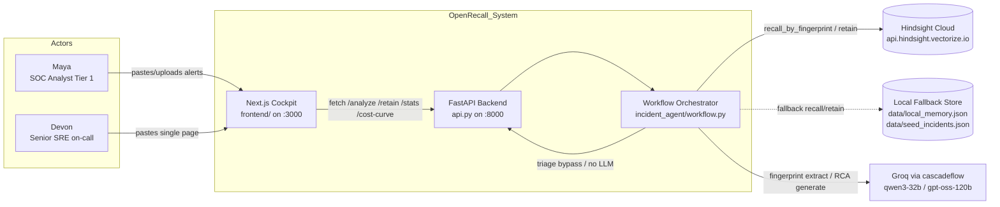
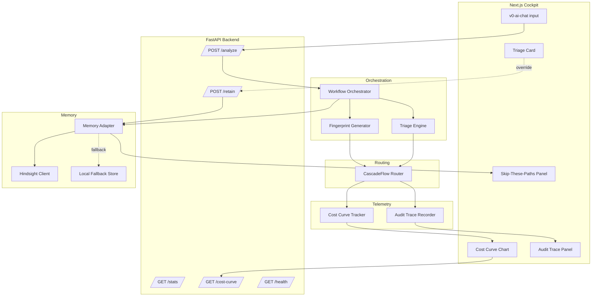
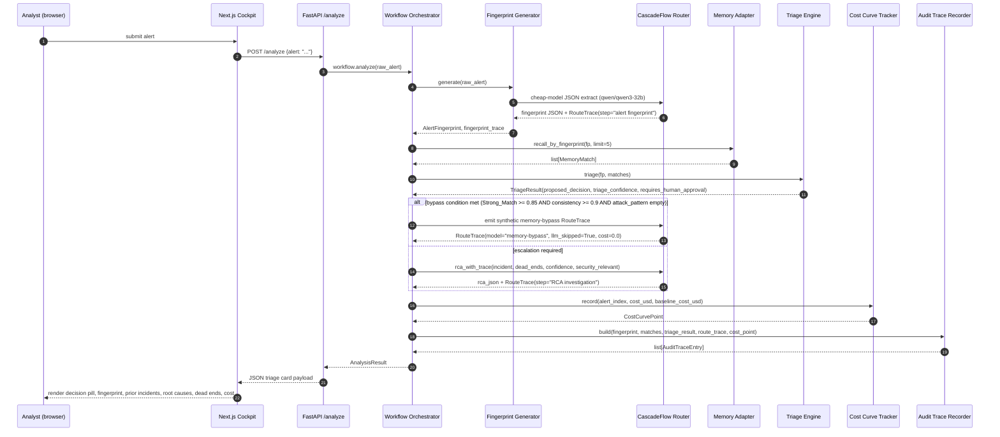
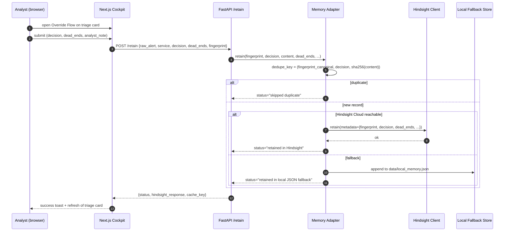

# Architecture

OpenRecall is a queue-driven alert triage co-pilot built on three
load-bearing ideas: counterfactual memory keyed on a structured Alert DNA
fingerprint, an auto-triage engine that bypasses the strong model when
memory is consistent, and a live cost curve that proves the cascadeflow
value in under sixty seconds of demo time.

The system runs as two cooperating processes:

- **`api.py`** — a FastAPI service holding the long-lived `IncidentMemory`,
  `CascadeFlowRouter`, `CostCurveTracker`, and `IncidentWorkflow`
  singletons. Exposes `/health`, `/stats`, `/cost-curve`, `/seed`,
  `/analyze`, `/retain`.
- **`frontend/`** — a Next.js 16 App Router application (Tailwind +
  shadcn) that renders the analyst cockpit and calls the FastAPI
  endpoints. CORS is wide open in development.

## System Context



## Components



## Single Alert Flow



## Retain After Override



## Triage Decision Flowchart

```mermaid
flowchart TD
    Start[AlertFingerprint fp + matches] --> Filter[Filter Strong_Matches: score >= 0.85]
    Filter --> HasStrong{any Strong_Match?}
    HasStrong -- no --> EscNoMatch[proposed_decision = escalated]
    HasStrong -- yes --> Group[group Strong_Matches by decision]
    Group --> Cons[Decision_Consistency = n_dominant / n_strong]
    Cons --> ConsCheck{>= 0.9?}
    ConsCheck -- no --> EscWeak[proposed_decision = escalated]
    ConsCheck -- yes --> AttackCheck{attack_pattern non-empty?}
    AttackCheck -- yes --> KillSwitch[propose dominant<br/>requires_human_approval=True<br/>security-novel rationale]
    AttackCheck -- no --> Propose[propose dominant<br/>requires_human_approval=True]
    Propose --> BypassCheck{decision in {fp, dup, kb}<br/>AND confidence >= 0.85?}
    BypassCheck -- yes --> Bypass[memory-bypass RouteTrace<br/>llm_skipped=True, cost=0.0]
    BypassCheck -- no --> InvokeStrong[Strong-model RCA<br/>with dead_ends in prompt]
    EscNoMatch --> InvokeStrong
    EscWeak --> InvokeStrong
    KillSwitch --> InvokeStrong
```

Threshold constants live as module-level `Final[float]` values in
`incident_agent/triage.py`:
- `STRONG_MATCH_THRESHOLD = 0.85`
- `DECISION_CONSISTENCY_THRESHOLD = 0.9`
- `BYPASS_CONFIDENCE_THRESHOLD = 0.85`

## Runtime Modes

| Mode | `HINDSIGHT_API_KEY` | `CASCADEFLOW_LIVE_GROQ` | Recall path | Fingerprint path | `/health` flags |
| --- | --- | --- | --- | --- | --- |
| Hindsight Cloud + live Groq | set, host reachable | true + key set | Cloud first, fallback if 5xx | Live cheap-model JSON | `hindsight_connected=true` + `groq_live=true` |
| Hindsight Cloud + Demo_Mode | set, host reachable | false | Cloud first, fallback if 5xx | Regex fallback | `hindsight_connected=true` + `groq_live=false` |
| Local Fallback + live Groq | unset/unreachable | true + key set | local JSON | Live cheap-model JSON | `hindsight_connected=false` + `groq_live=true` |
| Local Fallback + Demo_Mode | unset/unreachable | false | local JSON | Regex fallback | `hindsight_connected=false` + `groq_live=false` |

The Next.js cockpit reads `/health` on load and surfaces the four flag
combinations as badges in the header.

## Data Boundaries

- `data/seed_incidents.json` — 18 synthetic seed memories carrying
  `triage_decision` and `dead_ends`. Safe demo data.
- `data/seed_alerts.json` — 100 synthetic alerts (50 repeats / 30 false
  positives / 15 novel real / 5 ambiguous). Generated deterministically by
  `scripts/generate_seed_alerts.py`. Safe demo data.
- `data/local_memory.json` — generated by the learning loop. Should be
  gitignored in production deployments because it can carry retained
  triage decisions, dead ends, and analyst IDs.
- `data/decision_cache.json` — generated by the FastAPI alert hash cache.
  Process-local, gitignored.
- `.env` — never committed. Carries the live Hindsight Cloud API key and
  Groq API key.
